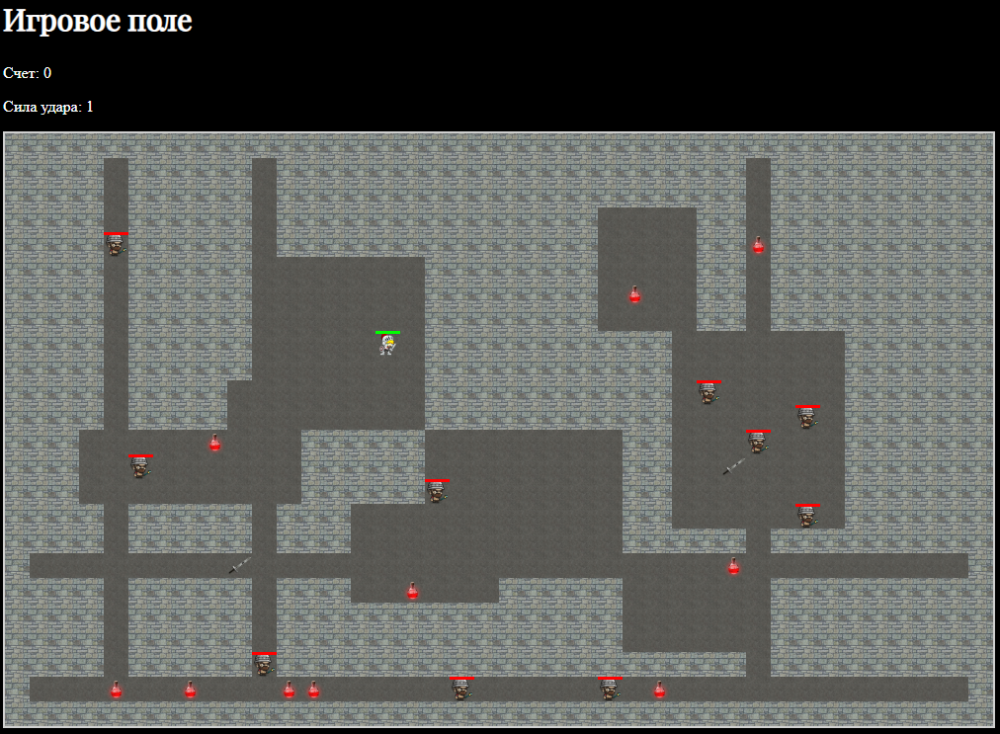

# РОГАЛИК - Пошаговая игра на JavaScript



### Основной функционал
- Генерация карты 40×24 клеток
- Система передвижения (WASD) и атаки (Пробел)
- 10 противников со случайным поведением
- Система здоровья и предметов (2 меча, 10 зелий)

## Быстрый старт

1. Клонируйте репозиторий:
```bash
git clone https://github.com/ваш-username/rogalik-game.git
